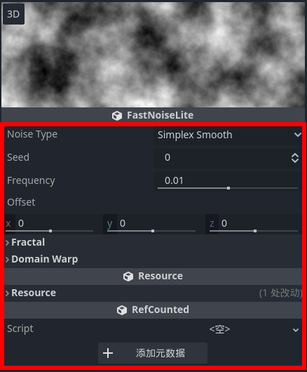
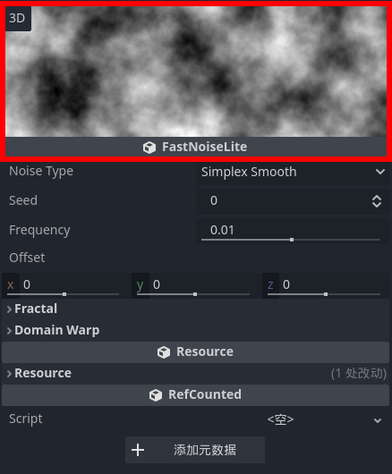

如果想要给一个自定义的对象（Node/Resource）在检查器中添加编辑界面，就要用到 EditorInspectorPlugin 。

这个类会自动生成基础的编辑界面，如下图中框出的部分所示，其中包含了 properties，以及 Fractal、Domain Warp 等 categories 。



当然，这种简单的编辑界面肯定是不够用的，很多时候都需要对编辑界面做一些改动，此时就要继承并重写其中的函数。

## 具体实现

首先要重写 \_can_handle 函数，表明该编辑器能处理的对象类型。该函数接受一个 Object，如果能处理则返回 true，否则返回 false。

常见的实现方法是对 Object 调用 cast_to 进行类型转换，判断转换结果是否为 nullptr 。

编辑器会在用户检查一个对象时遍历 plugin 列表，选择第一个 \_can_handle 返回 true 的 plugin 添加到检查器中。

然后会按如下流程调用函数：

1. 调用 \_parse_begin ，在开头添加自定义控件。

2. 为每个 category 和 property 调用 \_parse_category 和 \_parse_property。

- \_parse_group 在 category 的开头添加自定义控件。
- \_parse_property 在 property 的开头添加自定义控件。该函数有返回值，若返回 true 则会移除默认的编辑控件，只保留自定义控件。

3. 调用 \_parse_end，在末尾添加自定义控件。

在每个函数中，都是先构造一个自定义控件，再调用 add_custom_control 添加该控件。

除此之外，要为指定的 property 添加自定义控件，除了重写 \_parse_property ，还可以使用以下两个函数：

- add_property_editor
  在指定的 property 处添加自定义控件
- add_property_editor_for_multiple_properties
  在指定的多个 property 处添加自定义控件

两者均有 add_to_end 参数，若为 true 则将自定义控件控件加到默认控件之后。

两者都无法控制移除默认控件，如果要移除默认控件依然要重写 \_parse_property

最后，和其他自定义控件一样，记得使用 EditorPlugin 注册写好的属性编辑器。

## 例子

下图中通过重写 \_parse_begin 函数，为 FastNoiseLite 在开头添加了一个预览控件：



```cpp
// _parse_begin 中调用了该函数
void ZN_FastNoiseLiteEditorInspectorPlugin::_zn_parse_begin(Object *p_object) {
	const ZN_FastNoiseLite *noise_ptr = Object::cast_to<ZN_FastNoiseLite>(p_object);
	if (noise_ptr != nullptr) {
		Ref<ZN_FastNoiseLite> noise(noise_ptr);

		ZN_FastNoiseLiteViewer *viewer = memnew(ZN_FastNoiseLiteViewer);
		viewer->set_noise(noise);
		add_custom_control(viewer);
		return;
	}
	const ZN_FastNoiseLiteGradient *noise_gradient_ptr = Object::cast_to<ZN_FastNoiseLiteGradient>(p_object);
	if (noise_gradient_ptr != nullptr) {
		Ref<ZN_FastNoiseLiteGradient> noise_gradient(noise_gradient_ptr);

		ZN_FastNoiseLiteViewer *viewer = memnew(ZN_FastNoiseLiteViewer);
		viewer->set_noise_gradient(noise_gradient);
		add_custom_control(viewer);
		return;
	}
}
```
